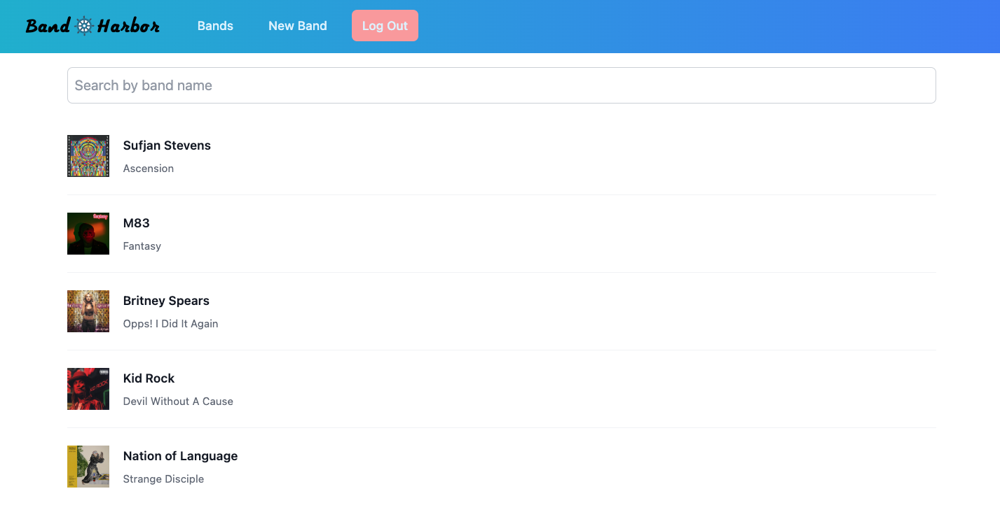

# What is Band Harbor?
Band Harbor is your hub for discovering and sharing bands. Whether you're into rock, pop, or indie, our community is all about connecting music fans. Post your favorite bands, find new recommendations, and join the conversation. Let's build a diverse playlist together at Band Harbor

# Technologies Used

# Getting Started
1. Start by creating a account
2. Log into account after successful account creation
3. Navigate to "Add Band" and add in your Brand and Model of guitar
4. Navigate to "Bands" and click on your desired band to start adding your recomendations
5. Add in your recommendation on the right and click "Add Recommendation" and see your post populate below in "User Recommendations"
6. Users have the option to edit or delete their comments after submitting

# Challenges
- I was excited to learn React from the beginning of this cohort and am looking forward to continue to build more React apps. This first app I found very challenging in a good way. Wrapping my head around prop drilling how to setup my page was what maybe slowed me down the most on this app. 

# Next Steps
- My initial intention was to create a site that utilized the Spotify API as its main resource, but was unable to get it to work. Will get that implemented next.
- Currently users have to input a URL to upload album art, but it would be ideal do setup a database so users can upload a photo
- Mobile functionality. Currently it's difficult to navigate on mobile

